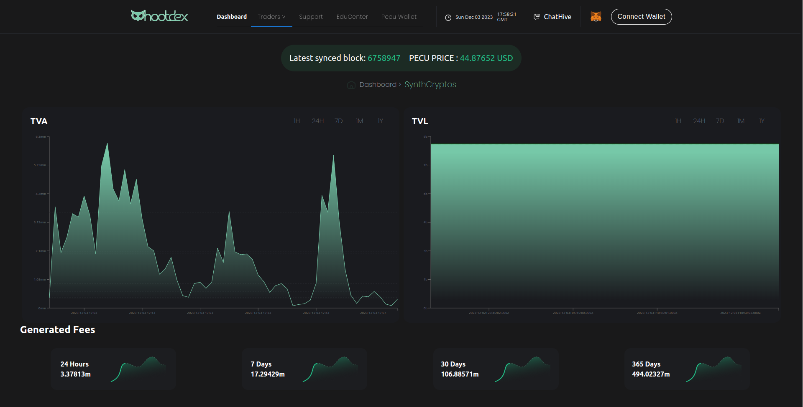
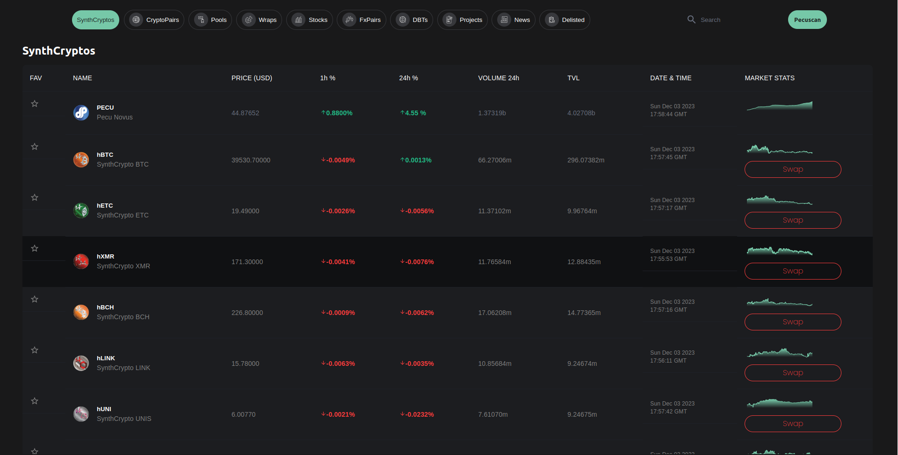
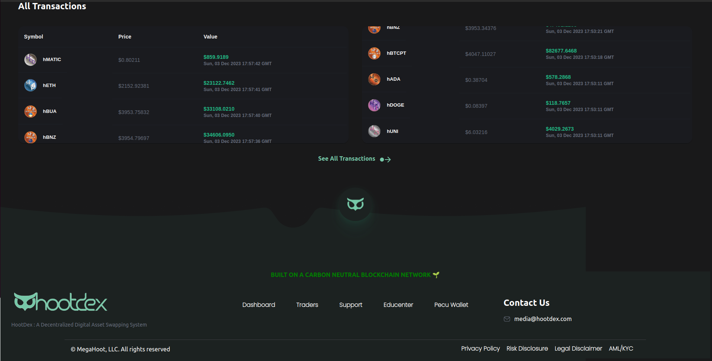

[Live](https://www.hootdex.net/)

# Hootdex

## Introduction

: HootDex is a decentralized digital asset exchange focusing on institutional trading
: Built with React.js Tailwind CSS, React Konva, NodeJs, MongoDB.

## Prerequisites

- Node.js (v16+)
  - React
  - React Konva
  - Tailwind CSS
    -Solidity
  - MongoDB
  - Nodejs
-

## Features: It aims to serve institutional investors like banks, hedge funds, and brokerage firms through features like:

- FIX API integration: This allows seamless integration with existing financial systems.
  Private trading: Enables conducting secure and confidential transactions off-chain.
  High liquidity: Targets to provide sufficient market depth for large trades

## Installation

## Deployment

- Deployed on AWS
- [Live](https://www.hootdex.net/)
